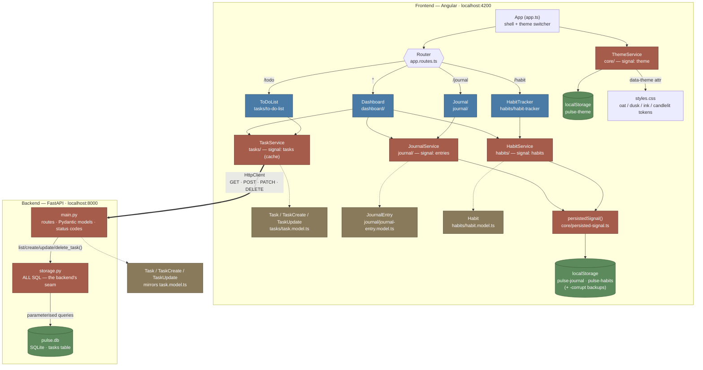

# Pulse Architecture

Pulse is two programs. The dashed HTTP arrow is the boundary between them —
everything above it runs in the browser, everything below it runs in uvicorn.

## Notes

- All pages are standalone Angular components (no NgModules).
- The app is organised by feature: each feature folder under `src/app/`
  (`dashboard/`, `tasks/`, `habits/`, `journal/`) co-locates its page component,
  model, service, and service spec. Cross-cutting code lives in `core/`.
- **The diagram is mid-migration, and that's the most important thing on it.**
  `TaskService` crosses the HTTP boundary to the server. `JournalService` and
  `HabitService` still go through the seam to localStorage. Phase 4 of
  `fable-plan.md` points those two at the backend as well, after which
  `persistedSignal` has no callers and is deleted.
- Every feature still follows the same *shape* — a page component injects a
  service, the service owns a signal, components only read it. What changed for
  tasks is what sits behind the signal: it's now a cache of the server's answer
  rather than the source of truth.
- Inside the backend the same seam idea repeats one level down: `main.py` speaks
  HTTP and never writes SQL; `storage.py` writes SQL and knows nothing about
  HTTP (it returns `bool` / `dict | None`, and `main.py` turns those into 404s).
- The two model boxes are one contract in two languages — the Pydantic models
  mirror `task.model.ts`, and per CLAUDE.md the backend must never be looser
  than the frontend declares.
- `ThemeService` is the odd one out — it lives in `core/`, is injected directly by
  the app shell (`app.ts`) rather than a page, and drives the four CSS-variable
  palettes in `styles.css` by setting `data-theme` on `<html>`. It is *not*
  migrating: a theme choice belongs to this browser, not to the user's data.
- Dashboard is a read-only aggregator: it injects all three feature services to
  show summary stats but doesn't own any state itself.
