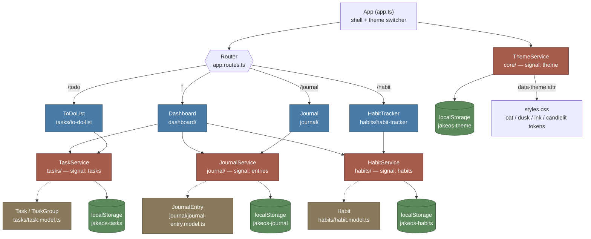

# JakeOS Architecture

## Notes

- All pages are standalone Angular components (no NgModules).
- The app is organised by feature: each feature folder under `src/app/`
  (`dashboard/`, `tasks/`, `habits/`, `journal/`) co-locates its page component,
  model, service, and service spec. Cross-cutting code lives in `core/`.
- Each feature (tasks, journal, habits) follows the same pattern: a page component
  injects a service; the service holds state in an Angular `signal`, persists it to
  `localStorage` via an `effect`, and exposes typed model interfaces.
- `ThemeService` is the odd one out — it lives in `core/`, is injected directly by
  the app shell (`app.ts`) rather than a page, and drives the four CSS-variable
  palettes in `styles.css` by setting `data-theme` on `<html>`.
- Dashboard is a read-only aggregator: it injects all three feature services to
  show summary stats but doesn't own any state itself.
