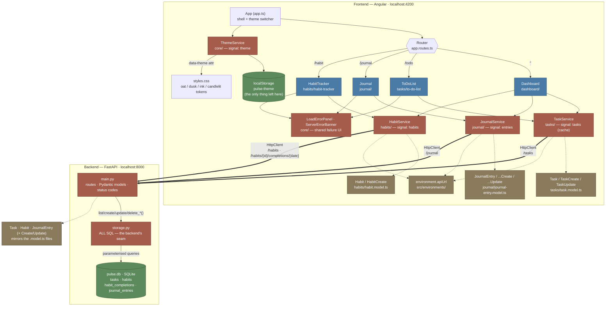

# Pulse Architecture

Pulse is two programs. The dashed HTTP arrow is the boundary between them —
everything above it runs in the browser, everything below it runs in uvicorn.

## Notes

- All pages are standalone Angular components (no NgModules).
- The app is organised by feature: each feature folder under `src/app/`
  (`dashboard/`, `tasks/`, `habits/`, `journal/`) co-locates its page component,
  model, service, and service spec. Cross-cutting code lives in `core/`.
- **The migration is finished, and that's the most important thing on it.** All
  three services cross the HTTP boundary; none of them touches localStorage.
  The seam that used to sit between them and the browser
  (`core/persisted-signal.ts`) was deleted once journal — its last caller —
  moved across.
- Every feature follows the same *shape* — a page component injects a service,
  the service owns a signal, components only read it. What the migration changed
  is what sits behind the signal: a cache of the server's answer, rather than
  the source of truth.
- **Three arrows now cross the boundary, and one of them is shaped differently.**
  Tasks and journal are plain collections. Habits has a sub-resource: a
  completion lives at `/habits/{id}/completions/{date}`, so ticking a day is
  `PUT` and unticking is `DELETE` — an instruction the server can't misread,
  rather than a "toggle" that means the opposite if it arrives twice.
- The `core/` boxes are shared by all three pages. Each one was written for
  tasks first and moved to `core/` when a second feature needed it unchanged —
  which is also why `environment.apiUrl` exists: the address was written out in
  five places before it had one home.
- Inside the backend the same seam idea repeats one level down: `main.py` speaks
  HTTP and never writes SQL; `storage.py` writes SQL and knows nothing about
  HTTP (it returns `bool` / `dict | None`, and `main.py` turns those into 404s).
- The model boxes at each end are one contract in two languages — the Pydantic
  models mirror the `.model.ts` files, and per CLAUDE.md the backend must never
  be looser than the frontend declares.
- `ThemeService` is the odd one out, and now the *only* thing left touching
  localStorage. It lives in `core/`, is injected directly by the app shell
  (`app.ts`) rather than a page, and drives the four CSS-variable palettes in
  `styles.css` by setting `data-theme` on `<html>`. It never migrated on
  purpose: a theme choice belongs to this browser, not to the user's data.
- Dashboard is a read-only aggregator: it injects all three feature services to
  show summary stats but doesn't own any state itself. It also reads all three
  `loadState`s, so a tile shows "Unavailable" rather than a confident zero when
  its service couldn't reach the server.
